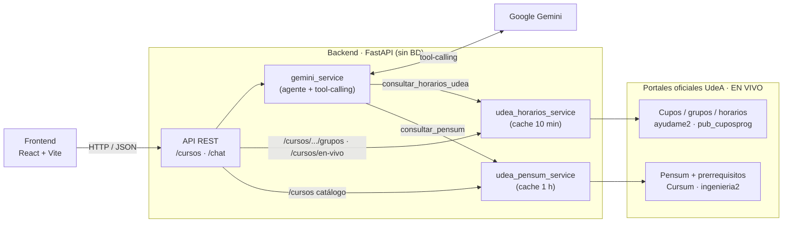

# 🎓 PlaneAI UdeA

> Asistente conversacional de **planeación académica** para estudiantes de la
> **Facultad de Ingeniería de la Universidad de Antioquia**.

PlaneAI UdeA ayuda al estudiante a **armar su horario** y a **decidir qué materias
matricular**, combinando información **en vivo** de los portales oficiales de la
UdeA (pensum por nivel con prerrequisitos + cupos, grupos, horarios y profesores)
con un **agente de IA (Google Gemini)** que consulta esos datos por sí mismo y
responde en lenguaje natural.

**Sin base de datos:** toda la información se obtiene en tiempo real de fuentes
oficiales; el backend solo necesita una API key de Gemini para funcionar.

- **Autor:** jesus.torresq@udea.edu.co
- **Programa:** Ingeniería de Sistemas — Facultad de Ingeniería, UdeA

---

## 📌 El problema

Cada semestre, el estudiante debe cruzar a mano: qué materias le tocan según su
**nivel/semestre**, qué grupos tienen **cupos disponibles**, y que los **horarios
no se choquen**. Es tedioso y propenso a errores. **PlaneAI** automatiza ese cruce
y lo vuelve una conversación:

> *"Soy de primer semestre, ¿qué materias puedo matricular en la mañana?"*

El agente, ante esa pregunta, **primero** averigua las materias del nivel 1 en el
pensum oficial y **luego** revisa los cupos y horarios reales de esas materias.

---

## 🏗️ Arquitectura general

**Todo el dato es en vivo y no hay base de datos.** El catálogo de materias, los
prerrequisitos, los grupos, los cupos y los horarios se consultan en tiempo real de
dos portales oficiales de la UdeA. El chat es un **agente con tool-calling**: es el
propio modelo quien decide cuándo consultar cada fuente.



**Flujo en una frase:** el frontend conversa con el backend → el backend es un
agente Gemini que, según la pregunta, **consulta en vivo** el pensum (con
prerrequisitos) y la oferta de cupos de la UdeA → responde con horarios y
recomendaciones basadas en datos reales.

### ¿Por qué esta arquitectura?

| Decisión | Justificación |
|---|---|
| **Todo en vivo, sin BD** | Cupos y horarios cambian constantemente durante la matrícula. Consultarlos en vivo (con caché corta) garantiza datos actuales sin un proceso de ingesta que quede obsoleto en minutos. |
| **IA agéntica (tool-calling)** | Gemini no recibe todo precargado: dispone de **herramientas** (`consultar_pensum`, `consultar_horarios_udea`) y **decide** cuándo usarlas según la pregunta. Es genuinamente *agéntico*. |
| **La IA NO inventa cupos** | El agente solo razona sobre lo que devuelven las herramientas (datos reales de los portales). Esto evita "alucinaciones" sobre cupos u horarios. |
| **Capa de *services*** | Los routers solo hablan HTTP; cada fuente (cupos, pensum) y el agente viven en servicios separados → código testeable y limpio. |

---

## 🧰 Stack tecnológico

| Capa | Tecnología | Rol |
|---|---|---|
| Frontend | **React + Vite** | Chat conversacional y vista de cupos |
| Backend | **Python 3.13 + FastAPI** | API REST, validación, orquestación |
| IA | **Google Gemini** (tool-calling) | Agente que consulta las fuentes y razona |
| Fuentes en vivo | **requests + regex/JSON** | Cupos/horarios (`pub_cuposprog`) y pensum (Cursum) |
| Configuración | **pydantic-settings** | Lectura tipada de variables de entorno (.env) |

> **Sin base de datos:** no se usa PostgreSQL, ORM ni migraciones. La única
> dependencia externa de configuración es la `GEMINI_API_KEY`.
>
> **Nota:** el backend requiere **Python 3.13**. Con 3.14 fallan los *wheels* de
> algunas dependencias fijadas (`pydantic-core`).

---

## 📂 Estructura del proyecto

```
planeai-udea/
├── README.md                  # Este documento
├── .gitignore
│
├── backend/                   # API (Python + FastAPI)
│   ├── requirements.txt
│   ├── .env.example           # Plantilla de variables de entorno
│   ├── check_api.py           # Smoke test de los endpoints
│   └── app/
│       ├── main.py            # Punto de entrada FastAPI (+ CORS, /health)
│       ├── config.py          # Configuración tipada (lee .env)
│       ├── schemas/           # Esquemas Pydantic (DTOs: cursos, grupos, chat)
│       ├── routers/           # Endpoints REST (cursos, chat)
│       └── services/
│           ├── udea_horarios_service.py   # Cupos/horarios EN VIVO (cache 10 min)
│           ├── udea_pensum_service.py     # Pensum + prerrequisitos EN VIVO (cache 1 h)
│           └── gemini_service.py          # Agente Gemini + herramientas
│
└── frontend/                  # Interfaz (React + Vite)
```

> No hay carpeta de modelos, ni `database.py`, ni migraciones, ni scraper: se
> eliminaron al pasar todo a datos en vivo.

---

## 🌐 Fuentes de datos en vivo

PlaneAI consulta dos portales oficiales en tiempo real (con caché para no
golpearlos en cada mensaje):

### 1) Cupos, grupos y horarios — `udea_horarios_service`

- **Fuente:** `https://ayudame2.udea.edu.co/php_mares/do.php?app=pub_cuposprog`
  (Facultad de Ingeniería = `25`, Programa = `504` Ingeniería de Sistemas).
- El portal exige un **flujo de sesión**: un `GET` que fija la cookie `PHPSESSID`
  y entrega un token `numrand`, y luego el `POST` del formulario.
- Su TLS es **antiguo** (solo TLSv1.2 con un cifrado RSA + CA autofirmada), así que
  la conexión usa un adaptador con `SECLEVEL=1` y verificación de certificado
  desactivada para ese host.
- Devuelve ~1000 grupos del semestre vigente. El servicio los parsea (incluyendo
  los códigos de día `L M W J V S` → lunes…sábado) y **cachea 10 min**.

### 2) Pensum y prerrequisitos — `udea_pensum_service`

- **Fuente:** API del portal Cursum (`https://wsingenieria.udea.edu.co:8094/cursum/ingenieria`),
  detrás de `https://ingenieria2.udea.edu.co/cursum`.
- Cada materia trae su **`nivel`**, que equivale al **semestre** (nivel 1 = primer
  semestre, etc.; nivel 99 = electivas), sus créditos y sus **prerrequisitos**
  (distingue PRERREQ de CORREQ). La versión vigente del pensum se detecta
  automáticamente. **Cachea 1 h** (el plan cambia poco).
- El pensum y el portal de cupos usan **el mismo código** de materia, así que se
  cruzan de forma **exacta**.

---

## 🤖 El agente (tool-calling)

El chat usa Gemini con **llamada automática a funciones**. Se le entregan dos
herramientas y el modelo decide cuándo invocarlas:

| Herramienta | Qué hace |
|---|---|
| `consultar_pensum(nivel)` | Materias de un nivel/semestre **con sus prerrequisitos** (del pensum oficial). |
| `consultar_horarios_udea(materia)` | Grupos, cupos, horarios y profesores en vivo. Acepta **varias materias** separadas por `;` para consultarlas en una sola llamada. |

**Ejemplo de razonamiento** ante *"Soy de primer semestre, ¿qué materias puedo
matricular en la mañana?"*:

1. Llama `consultar_pensum(1)` → obtiene las materias del nivel 1 y sus prerrequisitos.
2. Llama `consultar_horarios_udea("materia A; materia B; …")` → cupos/horarios reales.
3. Filtra a la mañana, descarta grupos sin cupo, evita choques y responde.

---

## 🗃️ ¿Y la base de datos?

**No se usa ninguna.** En una versión anterior existía una base de datos
(PostgreSQL en Neon) cuya única razón de ser era guardar los **prerrequisitos**,
que el portal de cupos no expone. Al descubrir que **el pensum oficial sí los
publica** —y de forma más completa (con tipo PRERREQ/CORREQ)— y que **usa el mismo
código de materia** que el portal de cupos (cruce exacto), la base de datos quedó
**redundante** y se eliminó por completo, junto con el ORM, las migraciones y el
scraper.

**Qué se ganó:**
- El catálogo pasó de 8 materias (dataset semilla) a las **108 del programa completo**,
  siempre oficial y actualizado.
- Prerrequisitos oficiales y completos.
- **Despliegue más simple:** ya no hay base de datos que aprovisionar.

**El precio (decisión consciente):** el sistema depende de que los portales de la
UdeA estén disponibles. La caché en memoria lo mitiga en operación normal; si un
portal está caído **y** la caché está fría, la API devuelve un error controlado.

### Formato del horario (en la respuesta de la API)

Cada grupo en vivo se expone con su horario como lista de sesiones estructuradas, lo
que permite detectar choques al armar el plan:

```json
[
  { "dia": "martes", "hora_inicio": "06:00", "hora_fin": "08:00" },
  { "dia": "jueves", "hora_inicio": "06:00", "hora_fin": "08:00" }
]
```

---

## 🔌 API REST

| Método | Ruta | Descripción |
|---|---|---|
| `GET` | `/health` | Estado del servicio |
| `GET` | `/cursos` | Catálogo de materias (pensum). Filtro opcional `?nivel=N` |
| `GET` | `/cursos/{codigo}/grupos` | Grupos, cupos y horarios **en vivo** de una materia |
| `GET` | `/cursos/en-vivo` | Oferta completa (todas las materias y grupos) **en vivo** |
| `POST` | `/chat` | Mensaje del estudiante → el **agente** consulta las fuentes y responde con Gemini |

> El catálogo (`/cursos`) y la oferta (`/cursos/{codigo}/grupos`) comparten el mismo
> **código** de materia, así que el cruce entre ambos es directo.

---

## ▶️ Cómo ejecutar

### 1) Backend (API)

```bash
cd backend

# Entorno virtual (Python 3.13) + dependencias
python3.13 -m venv .venv
source .venv/bin/activate          # Linux/macOS  (.venv\Scripts\activate en Windows)
pip install -r requirements.txt

# Variables de entorno
cp .env.example .env               # Windows: copy .env.example .env
#   -> edita .env y coloca tu GEMINI_API_KEY

# Levantar el servidor
uvicorn app.main:app --reload
#   API:  http://localhost:8000
#   Docs: http://localhost:8000/docs   (Swagger interactivo)
```

> No hay migraciones ni carga de datos: el backend obtiene todo en vivo. Solo
> necesita la `GEMINI_API_KEY` en el `.env`.

### 2) Frontend (interfaz)

```bash
cd frontend
npm install
npm run dev
#   App:  http://localhost:5173
```

> Levanta **primero el backend** y luego el frontend. El backend habilita CORS
> desde `http://localhost:5173` (configurable en `CORS_ORIGINS`).
>
> Si esos puertos están ocupados, usa otro puerto y ajusta en el frontend
> `VITE_API_URL` (apuntando al backend) y en el backend `CORS_ORIGINS`.

---

