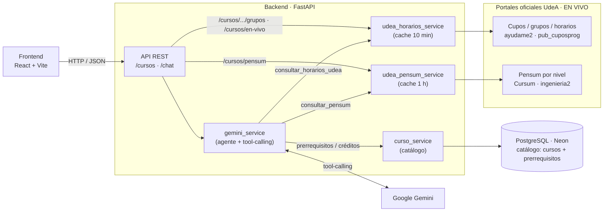
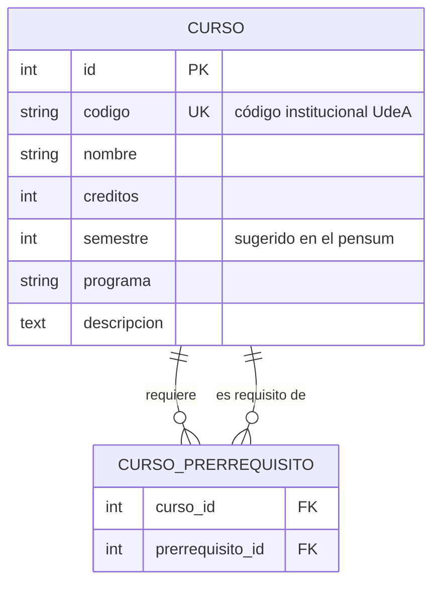

# 🎓 PlaneAI UdeA

> Asistente conversacional de **planeación académica** para estudiantes de la
> **Facultad de Ingeniería de la Universidad de Antioquia**.

PlaneAI UdeA ayuda al estudiante a **armar su horario** y a **decidir qué materias
matricular**, combinando información **en vivo** de los portales oficiales de la
UdeA (pensum por nivel + cupos, grupos, horarios y profesores) con un **agente de
IA (Google Gemini)** que consulta esos datos por sí mismo y responde en lenguaje
natural.

- **Autor:** jesus.torresq@udea.edu.co
- **Programa:** Ingeniería de Sistemas — Facultad de Ingeniería, UdeA

---

## 📌 El problema

Cada semestre, el estudiante debe cruzar a mano: qué materias le tocan según su
**nivel/semestre**, qué grupos tienen **cupos disponibles**, y que los **horarios
no se choquen**. Es tedioso y propenso a errores. **PlaneAI** automatiza ese cruce
y lo vuelve una conversación:

> *"Soy de primer semestre, ¿qué materias puedo matricular en la mañana?"*

El agente, ante esa pregunta, **primero** averigua las materias del nivel 1 en el
pensum oficial y **luego** revisa los cupos y horarios reales de esas materias.

---

## 🏗️ Arquitectura general

El dato de **grupos, cupos, horarios y pensum se obtiene EN VIVO** de los portales
oficiales de la UdeA (no se almacena). La base de datos guarda únicamente el
**catálogo** (cursos y prerrequisitos). El chat es un **agente con tool-calling**:
es el propio modelo quien decide cuándo consultar cada fuente.



**Flujo en una frase:** el frontend conversa con el backend → el backend es un
agente Gemini que, según la pregunta, **consulta en vivo** el pensum y la oferta de
cupos de la UdeA y cruza prerrequisitos con el catálogo de la BD → responde con
horarios y recomendaciones basadas en datos reales.

### ¿Por qué esta arquitectura?

| Decisión | Justificación |
|---|---|
| **Grupos/horarios en vivo** | Cupos y horarios cambian constantemente durante la matrícula. Consultarlos en vivo (con caché corta) garantiza datos actuales sin un proceso de ingesta que quede obsoleto en minutos. |
| **IA agéntica (tool-calling)** | Gemini no recibe todo precargado: dispone de **herramientas** (`consultar_pensum`, `consultar_horarios_udea`) y **decide** cuándo usarlas según la pregunta. Es genuinamente *agéntico*. |
| **La IA NO inventa cupos** | El agente solo razona sobre lo que devuelven las herramientas (datos reales de los portales). Esto evita "alucinaciones" sobre cupos u horarios. |
| **Catálogo en BD** | Lo estable (nombre, créditos, prerrequisitos) vive en PostgreSQL: es rápido de consultar y aporta los prerrequisitos que los portales de cupos no exponen. |
| **Capa de *services*** | Los routers solo hablan HTTP; cada fuente (BD, cupos, pensum) y el agente viven en servicios separados → código testeable y limpio. |

---

## 🧰 Stack tecnológico

| Capa | Tecnología | Rol |
|---|---|---|
| Frontend | **React + Vite** | Chat conversacional y vista de cupos |
| Backend | **Python 3.13 + FastAPI** | API REST, validación, orquestación |
| IA | **Google Gemini** (tool-calling) | Agente que consulta las fuentes y razona |
| Fuentes en vivo | **requests + regex/JSON** | Cupos/horarios (`pub_cuposprog`) y pensum (Cursum) |
| ORM | **SQLAlchemy 2** | Mapeo del catálogo (cursos + prerrequisitos) |
| Migraciones | **Alembic** | Versionado del esquema de BD |
| Base de datos | **PostgreSQL (Neon)** | Catálogo de cursos y prerrequisitos |
| Ingesta catálogo | **requests + BeautifulSoup** | Carga del catálogo (scraper / dataset semilla) |

> **Nota:** el backend requiere **Python 3.13**. Con 3.14 fallan los *wheels* de
> varias dependencias fijadas (`psycopg2-binary`, `pydantic-core`).

---

## 📂 Estructura del proyecto

```
planeai-udea/
├── README.md                  # Este documento
├── .gitignore
│
├── backend/                   # API (Python + FastAPI)
│   ├── requirements.txt
│   ├── .env.example           # Plantilla de variables de entorno
│   ├── check_api.py           # Smoke test de los endpoints
│   └── app/
│       ├── main.py            # Punto de entrada FastAPI (+ CORS, /health)
│       ├── config.py          # Configuración tipada (lee .env)
│       ├── database.py        # Engine, sesión y Base de SQLAlchemy
│       ├── models/            # Modelo ORM del catálogo -> Curso (+ prerrequisitos)
│       ├── schemas/           # Esquemas Pydantic (DTOs)
│       ├── routers/           # Endpoints REST (cursos, chat)
│       ├── services/
│       │   ├── curso_service.py          # Catálogo (BD)
│       │   ├── udea_horarios_service.py   # Cupos/horarios EN VIVO (cache 10 min)
│       │   ├── udea_pensum_service.py     # Pensum por nivel EN VIVO (cache 1 h)
│       │   └── gemini_service.py          # Agente Gemini + herramientas
│       └── db/
│           └── schema.sql     # DDL de referencia de la BD
│
├── scraper/                   # Ingesta batch del CATÁLOGO
│   ├── scraper.py             # Extracción de fuentes oficiales
│   ├── run_scraper.py         # Orquestador + carga de cursos/prerrequisitos
│   └── seed_data.json         # Dataset semilla de respaldo (fallback)
│
└── frontend/                  # Interfaz (React + Vite)
```

---

## 🌐 Fuentes de datos en vivo

PlaneAI consulta dos portales oficiales en tiempo real (con caché para no
golpearlos en cada mensaje):

### 1) Cupos, grupos y horarios — `udea_horarios_service`

- **Fuente:** `https://ayudame2.udea.edu.co/php_mares/do.php?app=pub_cuposprog`
  (Facultad de Ingeniería = `25`, Programa = `504` Ingeniería de Sistemas).
- El portal exige un **flujo de sesión**: un `GET` que fija la cookie `PHPSESSID`
  y entrega un token `numrand`, y luego el `POST` del formulario.
- Su TLS es **antiguo** (solo TLSv1.2 con un cifrado RSA + CA autofirmada), así que
  la conexión usa un adaptador con `SECLEVEL=1` y verificación de certificado
  desactivada para ese host.
- Devuelve ~1000 grupos del semestre vigente. El servicio los parsea (incluyendo
  los códigos de día `L M W J V S` → lunes…sábado) y **cachea 10 min**.

### 2) Pensum por nivel — `udea_pensum_service`

- **Fuente:** API del portal Cursum (`https://wsingenieria.udea.edu.co:8094/cursum/ingenieria`),
  detrás de `https://ingenieria2.udea.edu.co/cursum`.
- Cada materia trae su **`nivel`**, que equivale al **semestre** (nivel 1 = primer
  semestre, etc.; nivel 99 = electivas). La versión vigente del pensum se detecta
  automáticamente. **Cachea 1 h** (el plan cambia poco).

---

## 🤖 El agente (tool-calling)

El chat usa Gemini con **llamada automática a funciones**. Se le entregan dos
herramientas y el modelo decide cuándo invocarlas:

| Herramienta | Qué hace |
|---|---|
| `consultar_pensum(nivel)` | Materias de un nivel/semestre (del pensum oficial). |
| `consultar_horarios_udea(materia)` | Grupos, cupos, horarios y profesores en vivo. Acepta **varias materias** separadas por `;` para consultarlas en una sola llamada. |

**Ejemplo de razonamiento** ante *"Soy de primer semestre, ¿qué materias puedo
matricular en la mañana?"*:

1. Llama `consultar_pensum(1)` → obtiene las materias del nivel 1.
2. Llama `consultar_horarios_udea("materia A; materia B; …")` → cupos/horarios reales.
3. Filtra a la mañana, descarta grupos sin cupo, evita choques y responde.

El catálogo de la BD aporta los **prerrequisitos y créditos** (que los portales de
cupos no exponen), cruzados por nombre de materia.

---

## 🗃️ Modelo de datos (catálogo en BD)

La base de datos almacena **solo el catálogo**: la entidad `Curso` y una tabla de
asociación para los prerrequisitos (relación de `Curso` consigo mismo). Los
**grupos, horarios, cupos y profesores ya NO se persisten**: se consultan en vivo.



### Decisiones de diseño (para sustentar)

1. **¿Por qué los grupos/horarios NO están en la BD?**
   Los cupos y horarios cambian minuto a minuto durante la matrícula. Un dato
   persistido quedaría obsoleto; por eso se consultan **en vivo** del portal oficial
   y solo se cachean unos minutos. Así la recomendación refleja la realidad.

2. **¿Por qué el catálogo SÍ está en la BD?**
   El nombre, los créditos y, sobre todo, los **prerrequisitos** son estables y no
   los expone el portal de cupos. Tenerlos en PostgreSQL permite validar, por
   ejemplo, que no se matricule *Cálculo Integral* sin *Cálculo Diferencial*.

3. **¿Por qué los prerrequisitos son una tabla de asociación (N:M)?**
   Un curso puede tener varios prerrequisitos y ser, a la vez, prerrequisito de
   varios cursos: es una relación **muchos-a-muchos**, modelada con la tabla puente
   `curso_prerrequisito` (dos llaves foráneas hacia `cursos`).

4. **Formato del horario (en la respuesta de la API).**
   Cada grupo en vivo se expone con su horario como lista de sesiones estructuradas,
   lo que permite detectar choques al armar el plan:
   ```json
   [
     { "dia": "martes", "hora_inicio": "06:00", "hora_fin": "08:00" },
     { "dia": "jueves", "hora_inicio": "06:00", "hora_fin": "08:00" }
   ]
   ```

> El DDL completo (incluye las tablas históricas `grupos`/`profesores`, que ya no
> usa la aplicación) está en
> [`backend/app/db/schema.sql`](backend/app/db/schema.sql).

---

## 🔌 API REST

| Método | Ruta | Descripción |
|---|---|---|
| `GET` | `/health` | Estado del servicio |
| `GET` | `/cursos` | Lista los cursos del catálogo (filtros por programa/semestre) |
| `GET` | `/cursos/{id}` | Detalle del curso (descripción + prerrequisitos) |
| `GET` | `/cursos/{id}/grupos` | Grupos, cupos y horarios **en vivo** del curso |
| `GET` | `/cursos/en-vivo` | Oferta completa (todas las materias y grupos) **en vivo** |
| `GET` | `/cursos/pensum?nivel=N` | Materias del pensum por nivel/semestre (`N`; 99 = electivas) |
| `POST` | `/chat` | Mensaje del estudiante → el **agente** consulta las fuentes y responde con Gemini |

---

## 🔄 Ingesta del catálogo (batch)

Solo el **catálogo** (cursos + prerrequisitos) se carga por *batch*; los
grupos/horarios ya no se persisten. La ingesta es **robusta y con respaldo**:

1. `scraper.py` **intenta** extraer el catálogo de las fuentes oficiales.
2. Si falla (bloqueo, captcha, cambio de HTML, sin conexión), se carga
   **`seed_data.json`** para que la app **nunca se quede sin catálogo**.
3. `run_scraper.py` persiste cursos y prerrequisitos en PostgreSQL (idempotente).

> **Nota de integridad:** en `seed_data.json`, los *nombres* de las asignaturas son
> del pensum público de la UdeA; los demás campos son **representativos** para
> demostración. (Los grupos del seed se ignoran: los grupos vienen en vivo.)

---

## ▶️ Cómo ejecutar

### 1) Backend (API)

```bash
cd backend

# Entorno virtual (Python 3.13) + dependencias
python3.13 -m venv .venv
source .venv/bin/activate          # Linux/macOS  (.venv\Scripts\activate en Windows)
pip install -r requirements.txt

# Variables de entorno
cp .env.example .env               # Windows: copy .env.example .env
#   -> edita .env con tu DATABASE_URL (Neon) y tu GEMINI_API_KEY

# Crear las tablas del catálogo en la BD (migraciones)
alembic upgrade head

# Cargar el catálogo (intenta scraping; si falla, usa el dataset semilla)
cd .. && python -m scraper.run_scraper --solo-seed && cd backend

# Levantar el servidor
uvicorn app.main:app --reload
#   API:  http://localhost:8000
#   Docs: http://localhost:8000/docs   (Swagger interactivo)
```

### 2) Frontend (interfaz)

```bash
cd frontend
npm install
npm run dev
#   App:  http://localhost:5173
```

> Levanta **primero el backend** y luego el frontend. El backend habilita CORS
> desde `http://localhost:5173` (configurable en `CORS_ORIGINS`).
>
> Si esos puertos están ocupados, usa otro puerto y ajusta en el frontend
> `VITE_API_URL` (apuntando al backend) y en el backend `CORS_ORIGINS`.

---

## 🗺️ Estado y evolución

- [x] **Fase 1 — Diseño:** estructura del proyecto, modelo de datos y esquema de BD.
- [x] **Fase 2 — Base de datos:** conexión a Neon + migraciones con Alembic.
- [x] **Fase 3 — Ingesta:** scraper + carga del catálogo a PostgreSQL.
- [x] **Fase 4 — API:** endpoints de cursos.
- [x] **Fase 5 — IA:** endpoint `/chat` integrado con Gemini.
- [x] **Fase 6 — Frontend:** chat conversacional y vista de cupos.
- [x] **Fase 7 — Datos en vivo + IA agéntica:** grupos/horarios y pensum se consultan
      en vivo de los portales UdeA; el chat pasa a ser un agente con tool-calling.

> ✅ **Proyecto completo y funcional** (backend + agente IA + datos en vivo + frontend).
```
