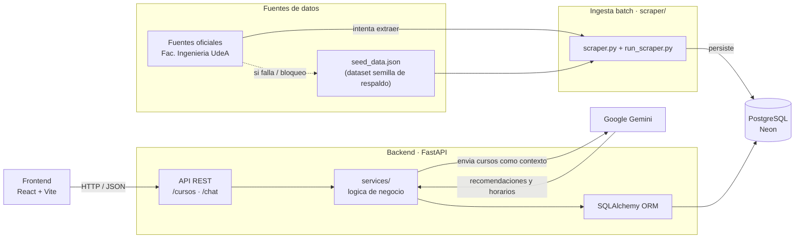
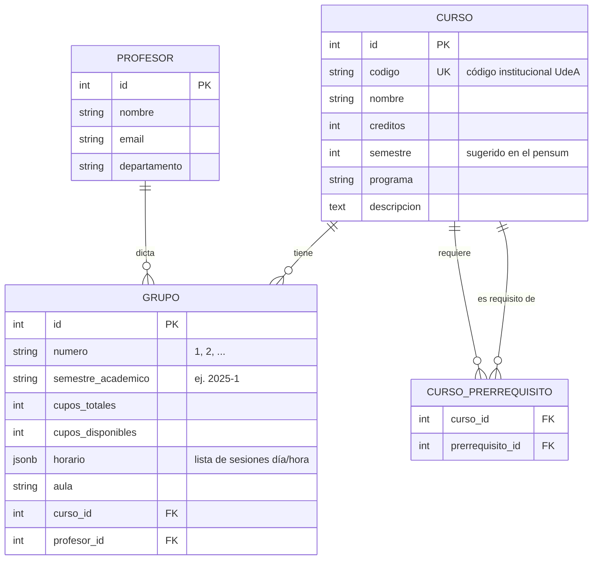

# 🎓 PlaneAI UdeA

> Asistente conversacional de **planeación académica** para estudiantes de la
> **Facultad de Ingeniería de la Universidad de Antioquia**.

PlaneAI UdeA ayuda al estudiante a **armar su horario** y a **decidir qué materias
matricular**, combinando los datos reales de la oferta de cursos (cupos, grupos,
horarios, profesores) con un **asistente de IA (Google Gemini)** que razona sobre
esos datos y responde en lenguaje natural.

- **Autor:** jesus.torresq@udea.edu.co
- **Programa:** Ingeniería de Sistemas — Facultad de Ingeniería, UdeA

---

## 📌 El problema

Cada semestre, el estudiante debe cruzar a mano: qué materias le tocan, qué grupos
tienen **cupos disponibles**, y que los **horarios no se choquen**. Es tedioso y
propenso a errores. **PlaneAI** automatiza ese cruce y lo vuelve una conversación:

> *"Soy de tercer semestre, quiero matricular Cálculo Integral y Matemáticas
> Discretas en la mañana, ¿qué grupos con cupo me sirven sin que se crucen?"*

---

## 🏗️ Arquitectura general

El sistema se divide en cuatro componentes desacoplados:



**Flujo en una frase:** un proceso *batch* llena PostgreSQL con la oferta de
cursos → el frontend conversa con el backend → el backend consulta la BD y le pasa
esos datos a Gemini como contexto → Gemini responde con horarios y recomendaciones.

### ¿Por qué esta separación?

| Decisión | Justificación |
|---|---|
| **Ingesta separada del API (batch)** | Scrapear es lento y las fuentes bloquean bots. No puede hacerse en cada petición del usuario; se ejecuta programado y deja los datos listos en la BD. |
| **Capa de *services*** | Los routers solo hablan HTTP; la lógica de negocio y la llamada a Gemini viven aparte → código testeable y limpio. |
| **La IA NO inventa cupos** | Gemini solo razona sobre los datos reales que el backend le entrega desde la BD. Esto evita "alucinaciones" sobre cupos u horarios. |

---

## 🧰 Stack tecnológico

| Capa | Tecnología | Rol |
|---|---|---|
| Frontend | **React + Vite** | Chat conversacional y vista de cupos |
| Backend | **Python + FastAPI** | API REST, validación, orquestación |
| ORM | **SQLAlchemy 2** | Mapeo objeto-relacional |
| Migraciones | **Alembic** | Versionado del esquema de BD |
| Base de datos | **PostgreSQL (Neon)** | Persistencia de cursos, grupos y profesores |
| IA | **Google Gemini** | Razonamiento conversacional sobre los datos |
| Ingesta | **requests + BeautifulSoup** | Scraping / carga del dataset semilla |

---

## 📂 Estructura del proyecto

```
planeai-udea/
├── README.md                  # Este documento
├── .gitignore
│
├── backend/                   # API (Python + FastAPI)
│   ├── requirements.txt
│   ├── .env.example           # Plantilla de variables de entorno
│   └── app/
│       ├── main.py            # Punto de entrada FastAPI (+ CORS, /health)
│       ├── config.py          # Configuración tipada (lee .env)
│       ├── database.py        # Engine, sesión y Base de SQLAlchemy
│       ├── models/            # Modelos ORM  -> Curso, Grupo, Profesor
│       ├── schemas/           # Esquemas Pydantic (DTOs)   [fase API]
│       ├── routers/           # Endpoints REST            [fase API]
│       ├── services/          # Lógica de negocio + Gemini [fase API/IA]
│       └── db/
│           └── schema.sql     # DDL de referencia de la BD
│
├── scraper/                   # Ingesta batch de datos
│   ├── scraper.py             # Extracción de fuentes oficiales  [fase datos]
│   ├── run_scraper.py         # Orquestador + carga a PostgreSQL [fase datos]
│   └── seed_data.json         # Dataset semilla de respaldo (fallback)
│
└── frontend/                  # Interfaz (React + Vite)          [fase front]
```

---

## 🗃️ Modelo de datos

Tres entidades principales (`Curso`, `Grupo`, `Profesor`) más una tabla de
asociación para los prerrequisitos. **`Grupo`** es la entidad central que conecta
un **`Curso`** con un **`Profesor`** y guarda la información operativa (cupos,
horario, aula); los **prerrequisitos** son una relación de `Curso` consigo mismo.



### Relaciones

- **Curso → Grupo (1:N):** un curso (p. ej. *Cálculo Diferencial*) se ofrece en
  varios grupos. Si se elimina el curso, se eliminan sus grupos (`ON DELETE CASCADE`).
- **Profesor → Grupo (1:N):** un profesor dicta varios grupos. Si se elimina el
  profesor, sus grupos quedan sin docente asignado (`ON DELETE SET NULL`).
- **Curso ↔ Curso (N:M):** prerrequisitos. Un curso puede requerir varios cursos
  y, a la vez, ser prerrequisito de otros, mediante la tabla `curso_prerrequisito`.

### Decisiones de diseño (para sustentar)

1. **¿Por qué separar `Curso` y `Grupo`?**
   Un *Curso* es el catálogo (la materia y sus créditos, que no cambian). Un *Grupo*
   es la oferta concreta de un semestre (cambia cada período: cupos, horario, aula,
   profesor). Separarlos evita repetir los datos del curso en cada oferta y refleja
   la realidad académica.

2. **¿Por qué los cupos van en `Grupo` y no en `Curso`?**
   Porque los cupos son **por grupo**: un mismo curso puede tener el grupo 1 lleno
   y el grupo 2 con disponibilidad.

3. **¿Por qué `Profesor` es una tabla y no un texto en `Grupo`?**
   Para **normalizar**: un profesor que dicta 3 grupos se almacena una sola vez, y
   podemos filtrar o recomendar por profesor sin duplicar datos.

4. **¿Por qué el horario es `JSONB` y no una cuarta tabla?**
   El alcance pide tres tablas (Curso, Grupo, Profesor). Un grupo tiene pocas
   sesiones (típicamente 1–3). Guardarlas como **JSONB** (tipo nativo de PostgreSQL,
   indexable y consultable) mantiene el modelo simple y, aun así, **estructurado**:
   permite detectar choques de horario al armar el plan. *(En un sistema de mayor
   escala se normalizaría a una tabla `sesiones`; aquí es una simplificación
   consciente y justificada.)*

   Ejemplo de una celda `horario`:
   ```json
   [
     { "dia": "lunes",     "hora_inicio": "06:00", "hora_fin": "08:00" },
     { "dia": "miercoles", "hora_inicio": "06:00", "hora_fin": "08:00" }
   ]
   ```

5. **¿Por qué los prerrequisitos son una tabla de asociación (N:M)?**
   Un curso puede tener varios prerrequisitos y ser, a la vez, prerrequisito de
   varios cursos: eso es una relación **muchos-a-muchos**. Se modela con la tabla
   puente `curso_prerrequisito` (dos llaves foráneas hacia `cursos`). Así el
   asistente puede validar, por ejemplo, que no se matricule *Cálculo Integral*
   sin haber aprobado *Cálculo Diferencial*.

> El DDL completo y comentado está en
> [`backend/app/db/schema.sql`](backend/app/db/schema.sql).

---

## 🔌 API REST (endpoints previstos)

| Método | Ruta | Descripción |
|---|---|---|
| `GET` | `/health` | Estado del servicio *(ya disponible)* |
| `GET` | `/cursos` | Lista los cursos (con filtros por programa/semestre) |
| `GET` | `/cursos/{id}/grupos` | Cupos y horarios por grupo de un curso |
| `POST` | `/chat` | Recibe el mensaje del estudiante, consulta la BD y responde con Gemini |

---

## 🔄 Estrategia de ingesta de datos (batch)

Las fuentes oficiales suelen **bloquear el scraping automatizado**. Por eso la
ingesta se diseña de forma **robusta y con respaldo**:

1. `scraper.py` **intenta** extraer la oferta real de las fuentes oficiales.
2. Si falla (bloqueo, captcha, cambio de HTML, sin conexión), se carga
   **`seed_data.json`** — un dataset semilla con cursos reales del pensum de
   Ingeniería de Sistemas — para que la app **nunca se quede sin datos**.
3. `run_scraper.py` persiste el resultado en PostgreSQL (de-duplicando profesores).

> Es un enfoque de **ingesta programada (batch)**, no en tiempo real: los datos se
> cargan periódicamente y quedan listos para consultas rápidas.
>
> **Nota de integridad:** en `seed_data.json`, los *nombres* de las asignaturas son
> del pensum público de la UdeA; los códigos, cupos, horarios y profesores son
> **representativos** para demostración.

---

## ▶️ Cómo ejecutar

### 1) Backend (API)

```bash
cd backend

# Entorno virtual + dependencias
python -m venv .venv
.venv\Scripts\activate            # Windows  (source .venv/bin/activate en Linux/macOS)
pip install -r requirements.txt

# Variables de entorno
copy .env.example .env            # Windows  (cp en Linux/macOS)
#   -> edita .env con tu DATABASE_URL (Neon) y tu GEMINI_API_KEY

# Crear las tablas en la BD (migraciones)
alembic upgrade head

# Cargar datos (intenta scraping; si falla, usa el dataset semilla)
cd .. && python -m scraper.run_scraper && cd backend

# Levantar el servidor
uvicorn app.main:app --reload
#   API:  http://localhost:8000
#   Docs: http://localhost:8000/docs   (Swagger interactivo)
```

### 2) Frontend (interfaz)

```bash
cd frontend
npm install
npm run dev
#   App:  http://localhost:5173
```

> Levanta **primero el backend** y luego el frontend. El backend ya habilita
> CORS desde `http://localhost:5173`.

---

## 🗺️ Estado y hoja de ruta

- [x] **Fase 1 — Diseño:** estructura del proyecto, modelo de datos y esquema de BD.
- [x] **Fase 2 — Base de datos:** conexión a Neon + migraciones con Alembic.
- [x] **Fase 3 — Ingesta:** scraper + carga del dataset semilla a PostgreSQL.
- [x] **Fase 4 — API:** endpoints de cursos y cupos.
- [x] **Fase 5 — IA:** endpoint `/chat` integrado con Gemini.
- [x] **Fase 6 — Frontend:** chat conversacional y vista de cupos.

> ✅ **Proyecto completo y funcional** (backend + IA + base de datos + frontend).
